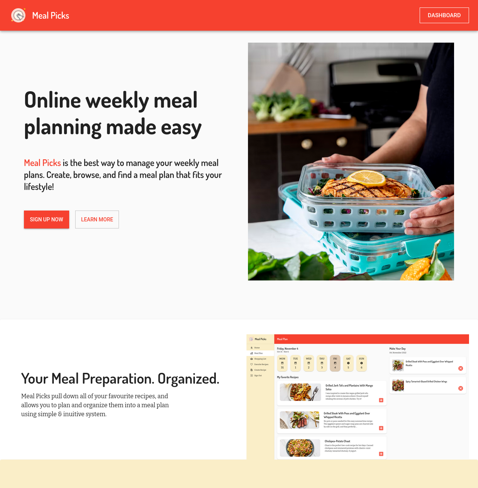

# Meal Picks

Meal Picks is a fully responsive web application for managing recipes, planning meals, building shopping lists and much more.

## Demo

[Live version on Netifly](https://meal-picks.netlify.app/)

## Table of contents

- [Getting Started](https://github.com/joedravarol/meal-picks#getting-started)
- [Built With](https://github.com/joedravarol/meal-picks#built-with)
- [Contributors](https://github.com/joedravarol/meal-picks#contributors)
- [License](https://github.com/joedravarol/meal-picks#license)
- [Acknowledgement](https://github.com/joedravarol/meal-picks#acknowledgement)

## Getting Started

These instructions will get you a copy of the project up and running on your local machine for development and testing purposes.

### Prerequisite

- Node.js
- Npm

### Installing

1. Fork this repository on Github.
1. Clone your forked repository onto your local computer.
1. Use `$ cd meal-picks` to move into the project directory.
1. `$ npm install` to install the required dependencies.
1. `$ nmp start` to run a local development server.
1. Explore and enjoy!

## Built with

- React (hooks)
- Redux
- React Router
- Axios
- Material UI
- Continuous deployment with Netifly
- Prettier
- ESLint

## Contributors

- **Joe Lee** - Initial work

## License

This project is licensed under the MIT license - see the [LICENSE](LICENSE) file for details

## Acknowledgement

- [Pixabay](https://www.pexels.com/@pixabay/) - Images on [Pexels](https://www.pexels.com/photo/berries-blackberries-close-up-cocktail-434295/)
- [Alex lvrs](https://unsplash.com/@alexlvrs) - Images on [Unsplash](https://unsplash.com/photos/sBDJADrnsbY)
- [Marina Pavlović](https://dribbble.com/marinapavlovic) - [Design Inspiration](https://dribbble.com/shots/13534538-EasyMeals-Food-Blog-WordPress-Theme)
- [Arron Hunt](https://dribbble.com/arronhunt) - [Design Inspiration](https://dribbble.com/shots/1884597-Meal-planning-landing-page)
- [Astral](https://astralapp.com/) - [Design Inspiration](https://astralapp.com/)
- [Caddiesoft](https://dribbble.com/Caddiesoft) - [Design Inspiration](https://dribbble.com/shots/14347541-Meal-Prep-Delivery-Service-App)
- [Yvonne Lee](https://dribbble.com/yvonneleedesign) - [Design Inspiration](https://dribbble.com/shots/12208637-Calendar-Meal-Prep-Dashboard)
- [Epicurious](https://www.epicurious.com/) - [Design Inspiration](https://www.epicurious.com/recipes-menus/the-best-new-pasta-recipes-to-try-gallery)
